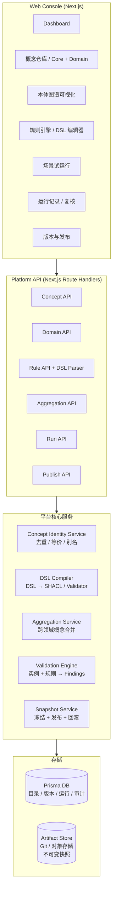

# 企业级本体平台 · 重设计文档 (v2)

> 本文档基于 `PROJECT_GUIDE.md` (v1) 重新设计。v1 用"打包发布 domain pack"的思路，v2 改为"在线编辑 + 注册中心 + 去重聚合 + DSL 规则"的思路。读完这一份就能上手开发与运维。

---

## 0. 一句话结论

> **本体不是包，是"在线治理的语义资产"。** 平台要让业务人员能看懂、能改、能复用，而不是只让研发打包发版。

v1 的核心问题：

| 痛点 | v1 做法 | v2 做法 |
|------|---------|---------|
| 发布方式 | 打包成 domain pack，CLI `publish-domain` 发版 | 在线编辑 → 校验 → 发布，全程 Web Console，无打包 |
| 跨领域复用 | 每个领域自己写一套概念，重复严重 | **核心本体（Core Ontology）+ 领域本体（Domain Ontology）**，跨领域概念聚合到 Core |
| 规则可读性 | 直接写 SHACL TTL，业务看不懂 | 自定义 **Rule DSL**（YAML 风格），编译成 SHACL；同时支持可读渲染 |
| 概念去重 | 无 | **Concept Identity Service**：基于 URI / 别名 / 哈希做去重与等价聚合 |
| 人能看懂 | RDF 三元组 + SPARQL | 图谱可视化 + DSL + 中文标签 + 可读规则渲染 |

---

## 1. 设计原则（先讲清楚为什么）

### 1.1 不打包发布，在线治理

v1 的"打包发布"思路有四个问题：

1. **业务用户改不动**：每次改本体都要让研发发版，节奏慢。
2. **评审/回滚链路长**：包级别的 diff 不直观。
3. **跨团队复用难**：A 团队的"员工"概念没法直接被 B 团队引用，只能 copy。
4. **版本爆炸**：每次小改都打一个新版本，治理成本高。

v2 改为：

```text
领域管理员在 Web Console 编辑概念 / 关系 / 规则
  → 平台实时做语法校验 + 语义去重 + 冲突检测
  → 评审通过后"发布"，写一个不可变快照到 Artifact Store（Git/对象存储）
  → DB 里只存目录、版本号、artifact_uri、状态
  → Worker 按 artifact_uri 拉快照执行
```

**关键点**：发布是"快照冻结"，不是"打包发版"。源数据始终在线可改，发布只是把某个版本固定下来。这和 Wiki 的"修订历史"是一个思路。

### 1.2 本体两层结构 + 去重聚合

跨领域一定有重复概念。比如：

| 领域 | 自己叫法 | 实际指向 |
|------|----------|----------|
| 报销 | Employee | Person |
| 采购 | Buyer | Person |
| 合同 | Signer | Person |
| 质量 | Inspector | Person |

如果每个领域自己写，就会得到 4 份"Person"定义，字段冲突、规则无法跨领域复用。

v2 用两层结构：

```text
┌─────────────────────────────────────────┐
│  Core Ontology（核心本体）              │
│  Person, Organization, Money, Date,     │
│  Address, Document, Amount, Geo ...     │
│  跨领域共享，由平台治理委员会维护        │
└────────────────┬────────────────────────┘
                 │ owl:equivalentClass / owl:sameAs
   ┌─────────────┼─────────────┐
   ▼             ▼             ▼
┌────────┐  ┌────────┐  ┌────────┐
│ 报销   │  │ 采购   │  │ 合同   │  ... 领域本体
│ Domain │  │ Domain │  │ Domain │
└────────┘  └────────┘  └────────┘
```

**Concept Identity Service** 负责：

- 同 URI → 同一概念
- 显式声明 `owl:equivalentClass` → 同一概念
- 别名表（Alias Registry）→ 同一概念
- 字段指纹哈希（同字段名 + 同类型 + 同语义标签）→ 提示可能重复

聚合视图对外暴露一个"全平台概念地图"，可以下钻到任何领域的具体定义。

### 1.3 规则要清晰：自定义 DSL

SHACL/TTL 是标准但难读。v2 设计一层 **Rule DSL**：

```yaml
# 人能直接读写的规则
- id: R-EXP-001
  name: 发票号不可重复
  severity: error
  target: ExpenseReport
  when:
    any:
      - lines[*].invoice.number == lines[*].invoice.number  # 同单内重复
  message: "发票号 {{a.invoice.number}} 在报销单内重复出现"
  explanation: |
    公司财务制度第 3.2 条：同一报销单内发票号必须唯一，
    防止重复报销。
```

DSL 设计原则（参考 CUE + LinkML + Rego 的可读性）：

1. **YAML 兼容**：直接当 YAML 写，工具链友好。
2. **声明式**：`when` 描述条件，`then` 描述动作，不写过程。
3. **可读渲染**：平台把 DSL 渲染成"中文句子 + 表格"，业务能看懂。
4. **可编译**：DSL → SHACL（默认）/ JSON Schema / 自定义校验器。
5. **可测试**：每条规则可挂"黄金样本"（正/反例）。
6. **可组合**：规则集（RuleSet）按场景组合复用。

DSL 同时支持 **表达式函数**（`standard(city, level)`、`lookup(org_id)`、`sum(lines[*].amount)`），复杂逻辑通过受治理的 Function Registry 引入，不能任意写代码。

### 1.4 人能看懂：三视图统一

每个核心实体（概念 / 关系 / 规则 / 实例）都提供三个视图：

1. **图视图（Graph）**：节点 + 边，看关系。
2. **表视图（Table）**：字段 + 类型 + 约束，看结构。
3. **文本视图（Text）**：DSL / TTL / 中文描述，看细节。

业务用户看图 + 表 + 中文，研发看 DSL + TTL。同一份数据，不同视角。

---

## 2. 总体架构



边界规则：

- **Console 不直接读写本体文件**，只调 API。
- **API 不写业务校验逻辑**，只编排核心服务。
- **核心服务不知道"报销"是什么**，只处理通用 Concept / Rule / Snapshot。
- **Artifact Store 是事实来源**，DB 是查询入口 + 状态机。

---

## 3. 数据模型

### 3.1 概念层

```text
Concept (核心概念)
  id, uri, label_zh, label_en, description, 
  type (CLASS / PROPERTY / ENUM),
  status (DRAFT / PUBLISHED / DEPRECATED),
  owner_domain_id (null = 平台核心),
  json_schema (字段定义),
  version, created_by, created_at, updated_at

ConceptAlias (概念别名 / 同义词)
  id, concept_id, alias, alias_type (LABEL / URI / CODE),
  source_domain_id, confidence

ConceptEquivalence (等价关系 - 去重核心)
  id, concept_a_id, concept_b_id, 
  equivalence_type (EXACT / NARROW / BROAD / RELATED),
  evidence (依据：人工声明 / 自动检测 / 哈希匹配),
  status (PROPOSED / CONFIRMED / REJECTED)
```

### 3.2 领域层

```text
Domain (领域)
  id, code, name_zh, name_en, description, 
  status, owner, icon, color

DomainConcept (领域内的概念定义，可能 link 到核心 Concept)
  id, domain_id, local_name, local_uri,
  linked_concept_id (nullable - null 表示该领域独有),
  json_schema, status, version

DomainRelation (领域内/跨领域关系)
  id, domain_id, name,
  source_concept_id, target_concept_id,
  relation_type (CONTAINS / BELONGS_TO / REFERENCES / ...),
  cardinality (1:1 / 1:N / N:M),
  description
```

### 3.3 规则层

```text
RuleSet (规则集)
  id, domain_id, name, description,
  version, status, published_at

Rule (单条规则 - DSL)
  id, ruleset_id, code (R-EXP-001),
  name, severity (ERROR / WARN / INFO),
  target_concept_id, target_path,
  dsl (YAML 原文),
  compiled_shacl (编译产物 - 可空),
  message_template, explanation,
  status, version

RuleTest (规则黄金样本)
  id, rule_id, 
  sample_input (JSON),
  expected_result (PASS / FAIL),
  expected_message
```

### 3.4 运行层

```text
Scenario (场景 / Action)
  id, domain_id, code, name,
  input_schema, ruleset_ids[],
  prompt_template, ui_schema

RunRecord (一次运行)
  id, scenario_id, domain_version,
  input_documents[], status,
  started_at, finished_at, error

ExtractedObject (抽取的结构化对象)
  id, run_id, concept_id, json_payload

Finding (规则命中)
  id, run_id, rule_id, severity,
  target_path, message, context_json

AuditLog (审计)
  id, actor, action, entity_type, entity_id,
  before_json, after_json, at
```

---

## 4. Rule DSL 完整规范

### 4.1 一条规则的完整字段

```yaml
- id: R-EXP-002              # 全局唯一，建议 R-<领域>-<序号>
  name: 住宿费超标            # 中文名
  severity: warning          # error | warning | info
  target: ExpenseReport      # 目标概念
  target_path: lines[*]      # 作用路径，支持 [*] / [0] / .field
  when:                      # 触发条件，声明式
    all:
      - type == "住宿"
      - amount > std_hotel_max(city, employee.level)
  then:                      # 触发后动作（可选）
    - require_approval: "部门经理"
    - tag: "超标"
  message: "{{city}} 住宿 {{amount}} 元超过 {{level}} 标准 {{std_hotel_max(city, employee.level)}} 元"
  explanation: |
    差旅制度 4.1.2：住宿费按城市与职级有上限，
    超过标准需部门经理额外审批。
  references:                # 引用文档
    - "差旅制度.md#4.1.2"
  tags: [差旅, 住宿, 超标]
  tests:                     # 黄金样本，可独立跑
    - name: 上海经理级超标
      input: { city: "上海", level: "M1", amount: 900 }
      expect: fail
    - name: 苏州普通员工合规
      input: { city: "苏州", level: "P5", amount: 350 }
      expect: pass
```

### 4.2 表达式语法（人能读懂的最小子集）

```text
比较：    ==  !=  >  >=  <  <=
逻辑：    all:  / any:  / not:
集合：    in:  / not_in:  / contains:
路径：    a.b.c       # 嵌套字段
        lines[*]    # 数组遍历
        lines[0]    # 索引
函数：    sum(path) / count(path) / max(path) / min(path)
        lookup(table, key) / now() / today()
        std_hotel_max(city, level)   # 受治理的领域函数
变量：    {{path}}    # message 模板插值
```

**禁止**：任意 JavaScript / Python 表达式。函数必须在 Function Registry 注册，受版本治理。

### 4.3 DSL → SHACL 编译示例

输入 DSL：

```yaml
when:
  all:
    - type == "住宿"
    - amount > 600
```

编译产物（SHACL，简化）：

```turtle
ex:HotelOverspendShape a sh:NodeShape ;
  sh:targetClass ex:ExpenseLine ;
  sh:rule [
    sh:condition [
      sh:path ex:type ; sh:hasValue "住宿" ;
    ] ;
    sh:property [
      sh:path ex:amount ;
      sh:maxInclusive 600 ;
      sh:message "住宿费超标" ;
    ] ;
  ] .
```

业务用户不需要看 SHACL。研发可以下钻看。

### 4.4 可读渲染（中文）

平台把上面那条规则渲染成：

```text
规则 R-EXP-002 · 住宿费超标
  等级：警告
  适用于：报销单.费用明细
  条件：当 费用类型 = 住宿 且 金额 > 城市+职级对应标准 时
  动作：要求 部门经理 审批；打标"超标"
  提示："{城市} 住宿 {金额} 元超过 {职级} 标准 {标准} 元"
  依据：差旅制度 4.1.2
```

这就是"人能看懂"的落地。

---

## 5. 去重与聚合算法

### 5.1 三层去重

```text
Layer 1: 显式声明（强）
  - 同 URI → 同概念
  - owl:equivalentClass 声明 → 同概念
  → 直接合并，无需评审

Layer 2: 别名匹配（中）
  - ConceptAlias 表：报销.Employee、采购.Buyer、合同.Signer 都指向 Person
  - 别名 confidence > 0.8 → 自动建议合并，等评审
  - confidence 0.5~0.8 → 进入"待确认"队列

Layer 3: 字段指纹（弱）
  - 字段名 + 类型 + 语义标签的哈希
  - 哈希碰撞 → 提示"可能重复"，仅提示不合并
```

### 5.2 聚合视图 API

```text
GET /api/aggregation/concepts
  → 全平台概念地图（去重后）
  → 每个概念：label, 等价概念列表, 引用此概念的领域列表

GET /api/aggregation/concepts/{id}/usages
  → 这个概念被哪些领域引用、被哪些规则引用、被哪些场景引用

GET /api/aggregation/domains/{id}/overlap
  → 这个领域与其他领域的概念重叠矩阵
  → 用于发现"可以下沉到 Core"的候选概念
```

### 5.3 冲突检测

两条规则可能冲突（一条说必须，一条说禁止）。平台在发布前做：

- 同 target_path + 互补 condition → 标记冲突
- 同 target + 不同 severity → 警告
- 同 message_template → 提示合并

冲突未解决不允许发布。

---

## 6. 发布与版本

### 6.1 不是打包，是快照冻结

```text
编辑（Draft）→ 校验（语法+语义+冲突）→ 评审（人工/审批流）→ 发布（Snapshot 冻结）
```

发布动作：

1. 把当前 Draft 区的所有 Concept / Rule / Relation 序列化为 JSON-LD + DSL 包。
2. 写入 Artifact Store，得到 `artifact_uri`（不可变）。
3. DB 记录：`version = v1.2.0`，`artifact_uri = ...`，`status = PUBLISHED`，`published_by`，`published_at`。
4. 旧版本不删除，可回滚。

### 6.2 制品结构（一个快照里有什么）

```text
snapshot-v1.2.0/
  manifest.json           # 元信息
  core-ontology.jsonld    # 核心本体
  domains/
    reimbursement/
      domain.json
      concepts.jsonld
      rules.json          # DSL 原文
      rules.shacl.ttl     # 编译产物
      tests.json
  aggregation.json        # 等价关系图
```

### 6.3 回滚

```text
POST /api/domains/{id}/versions/{v}/rollback
  → 把 v 设为 active_version
  → 不删除新版本，只是切换指针
```

---

## 7. Web Console 页面蓝图

| 页面 | 目标用户 | 核心能力 |
|------|----------|----------|
| Dashboard | 所有人 | 概念总数、规则总数、领域覆盖、最近运行、待办评审 |
| 概念仓库 | 平台治理 + 领域管理员 | Core/Domain 概念列表、去重提示、等价关系图、别名管理 |
| 本体图谱 | 所有人 | 可视化节点边、按领域着色、下钻概念详情 |
| 规则引擎 | 领域管理员 | DSL 编辑器（语法高亮）、可读渲染、测试样本、冲突检测 |
| 场景试运行 | 业务用户 | 选领域+Action+规则集 → 上传材料 → 运行 → 看 Findings |
| 运行记录 | 业务 + 复核员 | 运行列表、详情、人工复核、字段修订 |
| 版本与发布 | 治理委员会 | 版本树、diff、发布审批、回滚 |
| 设计文档 | 所有人 | 本文档的可视化版本 |

---

## 8. API 总览

```text
# 概念
GET    /api/concepts                      # 列表，支持 ?scope=core|domain|all
POST   /api/concepts                      # 新建
GET    /api/concepts/{id}
PUT    /api/concepts/{id}
DELETE /api/concepts/{id}
GET    /api/concepts/{id}/equivalences    # 等价概念
POST   /api/concepts/{id}/aliases         # 添加别名

# 聚合
GET    /api/aggregation/map               # 全平台概念地图
GET    /api/aggregation/concepts/{id}/usages
GET    /api/aggregation/domains/{id}/overlap

# 领域
GET    /api/domains
POST   /api/domains
GET    /api/domains/{id}
GET    /api/domains/{id}/concepts
GET    /api/domains/{id}/relations

# 规则
GET    /api/rulesets
POST   /api/rulesets
GET    /api/rulesets/{id}/rules
POST   /api/rules                         # 新建规则（DSL）
PUT    /api/rules/{id}
POST   /api/rules/{id}/compile            # 编译 DSL → SHACL
POST   /api/rules/{id}/test               # 跑黄金样本

# 场景与运行
GET    /api/scenarios
POST   /api/scenarios
POST   /api/runs                          # 创建运行
GET    /api/runs
GET    /api/runs/{id}
GET    /api/runs/{id}/findings
GET    /api/runs/{id}/extracted

# 发布
POST   /api/domains/{id}/versions         # 发布新版本
GET    /api/domains/{id}/versions
POST   /api/domains/{id}/versions/{v}/rollback
```

---

## 9. 与 v1 的迁移路径

| v1 概念 | v2 对应 | 迁移动作 |
|---------|---------|----------|
| domain pack (目录) | Domain + 在线编辑 | 把 `examples/domain_packs/*` 导入 DB |
| publish-domain CLI | Publish API | CLI 仅做批量导入 |
| LinkML schema | Concept + JSON Schema | 解析 LinkML → Concept |
| SHACL shapes TTL | Rule DSL → SHACL | 提供反向解析器（TTL → DSL 草稿） |
| pipeline YAML | Scenario + Run | 拆成 Scenario 定义 + Run 实例 |
| registry DB | 同 | 不变 |

---

## 10. 演进路线（v2 视角）

- **Phase A（本里程碑）**：在线编辑 + 去重 + DSL + 试运行，单领域（报销）跑通。
- **Phase B**：第二个领域（采购/合同）落地，验证聚合。
- **Phase C**：评审流 + 审计 + 多租户。
- **Phase D**：分布式 Worker + 生产数据库 + 监控。
- **Phase E**：评测体系 + 模型治理 + 字段级权限。

---

## 11. 常见问题

**Q：不打包会不会乱？**  
A：发布即冻结快照，Draft 区可以随便改但不可执行。生产只跑已发布版本。

**Q：DSL 会不会写不出复杂规则？**  
A：复杂逻辑通过 Function Registry 暴露受治理函数（如 `std_hotel_max`），DSL 只调用不写过程。极端复杂的可以注册自定义 Validator，但需要走评审。

**Q：去重会不会误合并？**  
A：Layer 1 强制，Layer 2 评审，Layer 3 仅提示。从不自动合并"待确认"项。

**Q：能不能导出成 v1 的 pack？**  
A：可以，发布快照本身就是一个等价物。导出按钮一键下载。

**Q：业务用户真的能看懂吗？**  
A：每个规则有"可读渲染"视图（中文句子），不暴露 DSL/SHACL。Dashboard 不出现专业术语。

---

*本文档是活文档，随平台迭代更新。最新版本见 Web Console → 设计文档页。*
